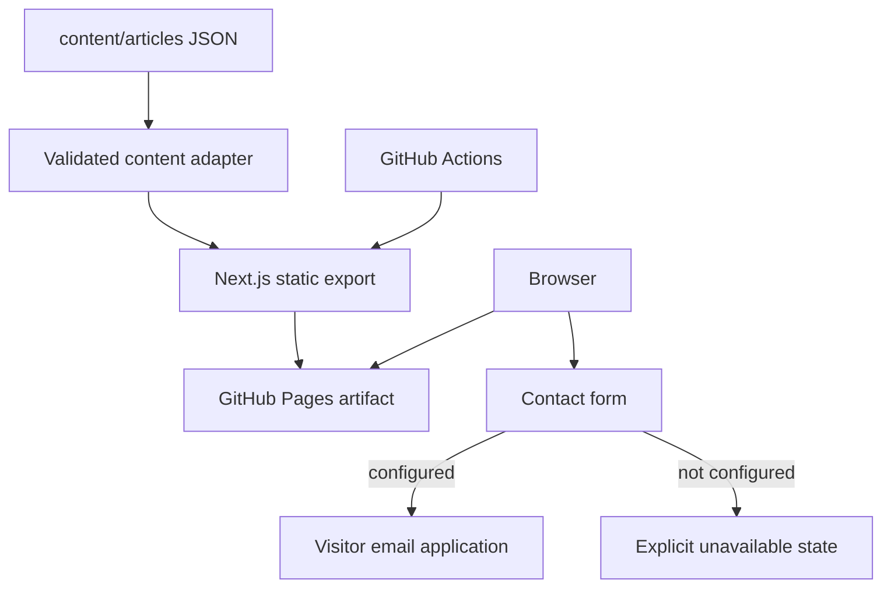

# Technical Architecture

## Architecture Goals

Medical accuracy boundaries, static crawlability, low JavaScript, accessibility, simple authoring, centralized configuration, and reproducible GitHub Pages deployment.

## Existing Repository Assessment

Initial discovery found only `.gitattributes` and one Git commit; there was no application to preserve. All six authoritative DOCX files subsequently became available under `source-documents/` and were audited before their content was imported. The supplied brand logo was retained; generic embedded imagery remains unused pending rights confirmation.

## Selected Technology Stack

| Technology | Use | Selection reason | Existing? |
|---|---|---|---|
| Next.js App Router | routes, static export, metadata | Integrated SEO and portable static output with minimal infrastructure | No |
| React + TypeScript strict mode | component UI and contracts | Type safety and accessible component composition | No |
| CSS Modules/global token CSS | design system and responsive layout | Avoids a Tailwind/component-library dependency for a small bespoke site | No |
| JSON article records | source-controlled content | One-file publishing, runtime validation, framework-neutral CMS migration | No |
| Vitest + Testing Library | pure and interaction tests | Lightweight test feedback for search, form, navigation/disclosures | No |

Rejected for current scope: a database and authentication (no persistent user data), MDX (would add compilation/plugin complexity and executable content risk), Tailwind/shadcn (no established Tailwind system and native components suffice), React Bits/Anime.js (motion is not needed), Uiverse code (bespoke tokenized CSS is smaller), external search (two articles), and a CMS (premature).

## Rendering Strategy

- Static generation: every public page, article, sitemap, robots file, and 404 is exported at build time.
- Build-time filesystem work: article discovery/validation, route generation, metadata, JSON-LD, and article HTML.
- Client rendering only: mobile menu, URL-aware search/filter state, accordion interaction, collapsible mobile table of contents, and email-draft preparation.
- Static-hosting compatibility: the Pages base path is applied to Next links, images, assets, canonicals, sitemap entries, and JSON-LD.

## Application Architecture

```text
content/articles/*.json       medically governed content records
public/images/                owned local SVG artwork and social image
src/app/                      App Router pages and metadata files
src/components/
  article/                    reusable reading components
  forms/                      contact interaction
  layout/                     shell, header, footer
  search/                     search/filter client island
  ui/                         generic accessible components
src/config/                   site and category source of truth
src/lib/                      content, search, validation, schema helpers
src/types/                    content contracts
src/styles/                   global tokenized design system
tests/                        unit/component/repository smoke tests
docs/                         operational and architectural documentation
```

## Routing Architecture

`/`, `/articles`, `/articles/[slug]`, `/about`, `/faq`, `/contact`, `/privacy`, `/robots.txt`, `/sitemap.xml`, and the global not-found route. Topic filtering uses `/articles?topic=<slug>` and initializes in the browser so the index remains statically exportable.

## Content Architecture

Each JSON record contains metadata plus structured blocks, FAQs, references, callouts, and related slugs. `src/lib/articles.ts` reads every file, validates required fields and unique slugs, and provides listing, static-param, sitemap, search, and page data. Unknown or missing clinical text is represented by an explicit `contentStatus`, never improvised.

## Search Architecture

The server passes a small serializable index to one client component. Normalized query tokens match title, excerpt, topic labels, and keywords; a topic filter composes with the query. See [SEARCH_ARCHITECTURE.md](SEARCH_ARCHITECTURE.md).

## Contact Architecture

The client validates the three general-message fields and opens a prefilled `mailto:` draft only when an owner-approved public recipient is configured. The website neither transmits nor stores the draft and never claims delivery. Without an address, it renders an explicit unavailable state. No medical files or records are accepted.

## SEO Architecture

Root metadata supplies safe defaults; each page overrides title/description/canonical. Article metadata and routes come from the validated record. Sitemap discovery is automatic. Article pages include breadcrumb and `Article` JSON-LD only for fields actually present; FAQs are crawlable and FAQ schema is limited to page-visible, medically approved answers.

## Error Handling

Unknown slugs call `notFound()`. Content validation fails the build with a filename-specific error. The contact component reports missing configuration without rendering unusable controls. Search provides an actionable empty state. Local illustrations avoid remote image failures.

## Image Architecture

Owned, non-clinical SVG illustrations live in `public/images`; metadata defines path, dimensions/aspect, and descriptive alt. Raster assets added later must use `next/image`, stable dimensions, and documented rights. The article card provides a styled fallback when an image is absent.

## Configuration Architecture

`src/config/site.ts` owns the supplied Her HealthBloom brand, owner credentials, provisional URL, base-path/absolute-URL helpers, descriptions, navigation, and disclaimers. `src/config/topics.ts` owns category labels, descriptions, and icon keys. The Pages workflow supplies deployment URL/path values; an optional public email variable controls contact availability.

## Future CMS Architecture and Scalability

The UI depends on normalized `Article` objects, not the filesystem. A future adapter can replace `getAllArticles()` while preserving pages/components. At 2–10 articles, build-time JSON plus client search is simplest. At 100+, static generation remains viable; build validation and search payload size should be measured. At materially larger scale, a CMS webhook/revalidation and server/search index can replace the adapters without redesign.

## Architecture Diagram



## Architecture Quality Gate

- [x] One content file adds an article; no bespoke page
- [x] Categories are centralized and extensible
- [x] Metadata feeds SEO, search, listings, and sitemap
- [x] Layout, FAQ, references, warnings, and disclaimers are reusable
- [x] Branding, domain, and contact settings are centralized
- [x] No database, authentication, unnecessary client JavaScript, or hardcoded secret
- [x] Mobile, accessibility, static export, and GitHub Pages base-path requirements are represented
