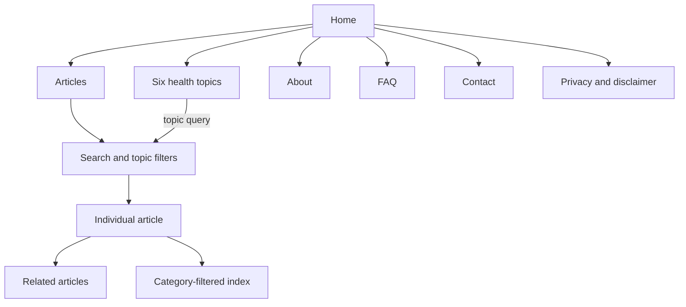

# Information Architecture

## Primary Navigation

Exactly six destinations appear in the header: Home, Articles / Blog, About, FAQ, Contact Us, and Privacy Policy & Medical Disclaimer. The text brand links to Home. The footer repeats concise primary links and selected topic links.

## Content Relationships

## Page Hierarchy

- Home: concise hero, latest available records, exactly six topic cards, trust/about summary.
- Articles: introduction, query search, category filters, result count, article grid/empty state.
- Article: breadcrumbs, header/meta, table of contents, body, FAQs, references, related content, author box, and disclaimer.
- About: supplied introduction, purpose, interests, philosophy, editorial standards, disclaimer, and closing.
- FAQ: website-policy questions, not individualized medical advice.
- Contact: non-emergency general message form with privacy warning.
- Privacy: source-aligned, implementation-accurate privacy policy and medical disclaimer.

Article breadcrumbs are `Home > Articles > Topic > Article`; the topic links to the filtered index. Internal links connect cards, topic filters, related records, About, Contact, and Privacy without creating false category landing pages.
